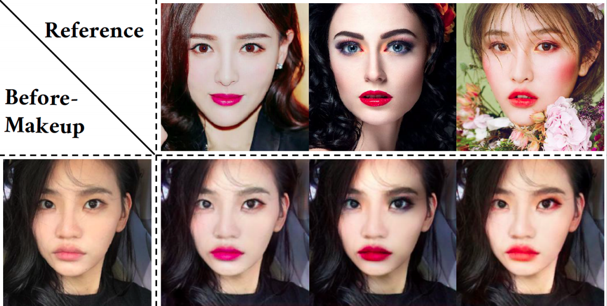
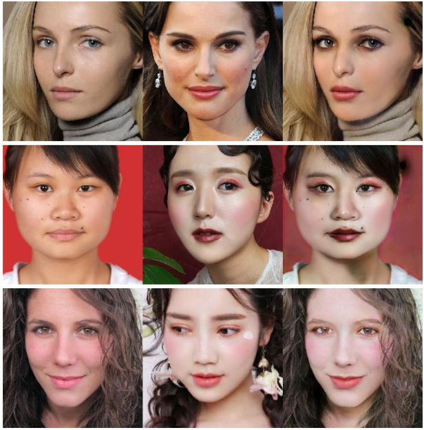
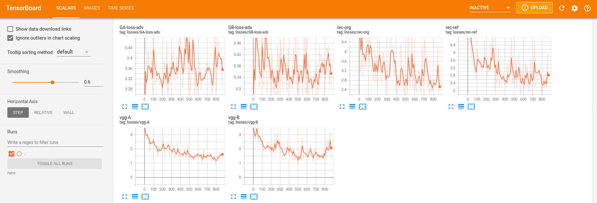
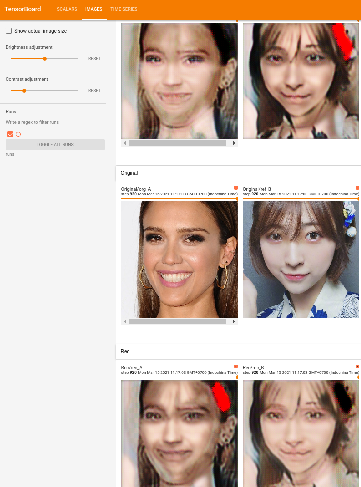

# BeautyGAN

BeautyGAN: Instance-level Facial Makeup Transfer with Deep Generative Adversarial Network

|  | 
|:--:| 
| *This image is from [BeautyGAN](liusi-group.com/pdf/BeautyGAN-camera-ready_2.pdf)* |

---

This is a modification of [Offical Pytorch code](https://github.com/wtjiang98/BeautyGAN_pytorch) for [BeautyGAN](liusi-group.com/pdf/BeautyGAN-camera-ready_2.pdf). The main differences are:

- Dataloaders
- Identities Loss (VGG)
- Add Tensorboard

🌿 If you have trouble running this code, feel free to send me an [issue](https://github.com/thaoshibe/BeautyGAN-pytorch-reimplementation/issues). I'll try my best to help you 👍.

> **_NOTE:_**: I got serveral checkpoint in [Google Drive](https://drive.google.com/drive/folders/1nNsxHFCvrko2QZ4a7LPCOkeGqB4wlYTk?usp=sharing). The results are not good as stated in the main paper, but check it if you like.

For the best results, I recommend [original tensorflow pre-trained model](https://github.com/Honlan/BeautyGAN)

---

### Requirements

First, clone this repo:

`git clone https://github.com/thaoshibe/BeautyGAN-pytorch-reimplementation.git`

&

`cd BeautyGAN-pytorch-reimplementation`

Install all required python packages:

- Via **pip**: `pip install -r requirements.txt`
- Via **conda**: `conda env create -f environment.yml` (then `conda activate beautygan`)

---

### Datasets

Please download the [Makeup Transfer Dataset](http://liusi-group.com/projects/BeautyGAN).

### Training Code

`python train.py --data_path /path/to/dataset`

For example: I downloaded Makeup Transfer Dataset to /home/ubuntu/makeup_dataset/. So the command will be `python train.py --data_path /home/ubuntu/makeup_dataset/`

- For Tensorboard: `tensorboard --logdir runs`, then open `http://localhost:6006/`

---

##### Results Snapshot

|  | 
|:--:| 
| *Results at epoch 80. From left to right: Original Image, Makeup Reference, Result* |

##### Tensorboard Snapshot

Tensorboard captured at **epoch 0**. The results are unpleasant at this time. Don't worry 🔥. To get the final model, I trained the model until **epoch 200 (about ONE WEEEK** in RTX 1080Ti)

|  | 
|:--:| 
| *Tensorboard Loss* |
|  |
| *Tensorboard Image*. First rows are fake images (results). Second are original images (inputs). Third are recycle images (reconstructed images)|

---

###### Acknowledgement

This code is heavily based on [BeautyGAN - Offical Pytorch Implementation](https://github.com/wtjiang98/BeautyGAN_pytorch). Thanks `wtjiang98` so much to make his work available 🙏🙏🙏

